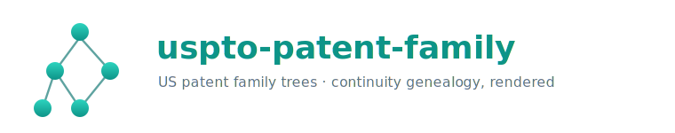
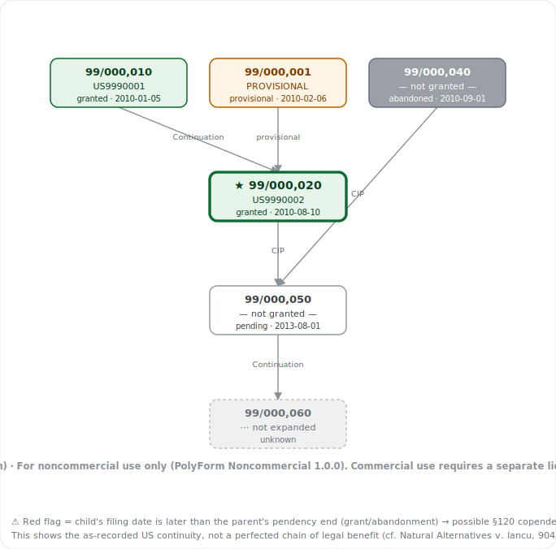

<div align="center">



### 美國專利家族樹 —— 從 USPTO 建立 *continuity*（母子譜系）並渲染成互動圖表

[English](README.md) | **中文**

[](LICENSE)
[](package.json)
[](#系統需求)
[](https://github.com/HunterKK1424/uspto-patent-family-oss/actions/workflows/ci.yml)
[](#連接到-mcp-客戶端)

[**工具**](#功能一覽) · [**安裝**](#安裝) · [**設定**](#連接到-mcp-客戶端) · [**取得金鑰**](#取得-uspto-odp-api-金鑰) · [**範例**](samples/sample-family-tree.html)



<sub><i>以合成資料渲染的範例輸出 —— 不需 API 金鑰。</i></sub>

</div>

> ### ⚠️ 這是 *continuity*，不是 INPADOC
> 本工具畫的是 **美國審查母子家族**（USPTO 內部的父/子 DAG）。它**不是** INPADOC 跨國同族
> （同一發明在其他國家提出的對應案）。兩者是不同的東西 —— 請勿混淆。

一個 [MCP](https://modelcontextprotocol.io) 伺服器，從 **USPTO 開放資料入口（ODP）** 建立
**美國國內專利家族樹** —— 即 *continuity* 母子譜系（continuation／continuation‑in‑part／
division／provisional，含 reissue 與 reexam 關聯）—— 並渲染成互動 HTML 圖表或 Mermaid 圖。

**先看看：** 用瀏覽器開啟 [`samples/sample-family-tree.html`](samples/sample-family-tree.html)，
即可看到以合成資料渲染的自包含互動範例（不需 API 金鑰）。

## 功能一覽

四個唯讀工具：

| 工具 | 用途 |
|------|------|
| `patent_continuity` | 一跳：單一申請案的直接母案與子案。 |
| `patent_family_tree` | 伺服器端 BFS 走訪整個 continuity DAG → `family_raw.json`。 |
| `patent_family_chart` | 把家族樹**渲染**出來 —— 互動 HTML（預設）或 Mermaid。 |
| `patent_status` | 是否已設定 API 金鑰，以及伺服器版本。 |

HTML 圖表為自包含（無外部請求）：篩選器（狀態／關係／申請人／只看直系／代數）、以申請日為軸的
**年度時間軸**（含 copendency 紅旗提示）、淺／深色切換、縮放拖曳、hover 詳情，以及內建 PNG／SVG 下載。

各工具的完整參數、輸出與範例提示詞見 [USAGE.md](USAGE.md)；版本紀錄見 [CHANGELOG.md](CHANGELOG.md)。

## 系統需求

- **Node.js ≥ 18** —— 執行 MCP 伺服器。
- **Python 3** —— 圖表渲染器（`patent_family_chart`）會呼叫內附的 `build/*.py`。若你只用
  `patent_family_tree`（原始 JSON），則不需要 Python。
- **一把免費的 USPTO ODP API 金鑰** —— 見下方。

## 取得 USPTO ODP API 金鑰

1. 於 [account.uspto.gov](https://account.uspto.gov) 登入（以 ID.me 驗證）。
2. 開啟 **Manage API Key** 並申請一把金鑰。
3. 一把 ODP 金鑰即涵蓋本伺服器使用的端點（以 `x-api-key` 標頭送出）。

該金鑰有**每週配額**且 **burst = 1**（同時只能一個請求）。本伺服器會將每次呼叫序列化，
並把回應快取到磁碟，以保護你的配額。

## 安裝

```bash
git clone https://github.com/HunterKK1424/uspto-patent-family-oss.git
cd uspto-patent-family-oss
npm install
npm run build
```

## 連接到 MCP 客戶端

本伺服器以 **stdio** 說 MCP，因此任何能啟動本機 MCP 伺服器的客戶端都能用 ——
**Claude Desktop／Code、Gemini CLI、Cursor、Cline、Continue、Windsurf、Zed**，以及
**OpenAI Agents SDK**。每種情況都是用 `node` 執行 `dist/index.js`，並在伺服器 `env` 中傳入
`USPTO_API_KEY`。

> **哪些客戶端？** 任何跑**本機** stdio MCP 伺服器的都可以（多數桌面 AI app 與 AI 程式編輯器）。
> **網頁版 ChatGPT 與 Gemini App 不會跑本機 MCP 伺服器** —— 要接那些需要遠端（HTTP）部署，
> 本 repo 未包含。

**已驗證：** 本伺服器已透過 **Claude Desktop**、**OpenAI Agents SDK**（`MCPServerStdio`）、
**Gemini CLI**，以及官方 MCP SDK client（TypeScript 與 Python 兩種）實際連線並操作
（連線 → 列出工具 → 呼叫工具）。**Cursor / Cline / Continue / Windsurf / Zed** 未逐一實測，
但使用相同的 stdio MCP 協定，設定方式相同。

### Claude Desktop

編輯 `claude_desktop_config.json`：

```jsonc
{
  "mcpServers": {
    "uspto-patent-family": {
      "command": "node",
      "args": ["/absolute/path/to/uspto-patent-family-oss/dist/index.js"],
      "env": {
        "USPTO_API_KEY": "your-odp-key-here"
      }
    }
  }
}
```

### Gemini CLI

把同一段加進 `~/.gemini/settings.json`（專案層級的 `.gemini/settings.json` 亦可）。Gemini CLI
會展開 `$VARS`，所以可以引用 shell 變數而不必把金鑰寫死：

```jsonc
{
  "mcpServers": {
    "uspto-patent-family": {
      "command": "node",
      "args": ["/absolute/path/to/uspto-patent-family-oss/dist/index.js"],
      "env": { "USPTO_API_KEY": "$USPTO_API_KEY" }
    }
  }
}
```

> **資料夾信任：** Gemini CLI 會停用「未受信任資料夾」中的 MCP 伺服器。若 `gemini mcp list`
> 顯示為 *Disabled*，請信任該工作區（Gemini 詢問時同意信任，或用 `/trust`）；信任後會顯示
> **Connected**。可用 `gemini mcp list` 確認。

這些 AI 程式編輯器用**相同的 `mcpServers` 結構** —— 把上面的 Claude Desktop 區塊加進編輯器的
MCP 設定即可（如 Cursor 的 `~/.cursor/mcp.json`、或 Cline 的 MCP 設定面板）：command 為 `node`、
args 為 `dist/index.js` 的絕對路徑、金鑰放 `env`。

### OpenAI Agents SDK（自建 GPT agent）

把伺服器當本機子行程啟動：

```python
from agents import Agent, Runner
from agents.mcp import MCPServerStdio

async def main():
    async with MCPServerStdio(params={
        "command": "node",
        "args": ["/absolute/path/to/uspto-patent-family-oss/dist/index.js"],
        "env": {"USPTO_API_KEY": "your-odp-key-here"},
    }) as server:
        agent = Agent(
            name="Patent assistant",
            instructions="Use the USPTO tools to answer US patent-family questions.",
            mcp_servers=[server],
        )
        result = await Runner.run(agent, "Show the US continuity for application 15/643,719.")
        print(result.final_output)
```

接著重啟客戶端（或執行你的 agent），問類似 *「show the US family tree for application
15/643,719」* 的問題。

> **圖表在不同客戶端的差異。** `patent_family_chart` 的互動 HTML 是設計成以 **Claude artifact**
> 呈現。其他客戶端會收到 HTML *文字*（存檔後用瀏覽器開）—— 所以在非 Claude 客戶端建議用
> `format: "mermaid"` 取得快速的內嵌圖，或用 `patent_family_tree` 取原始 JSON。
> `patent_continuity` ／ `patent_family_tree` 這兩個資料工具在每個客戶端行為一致。

### 不用客戶端也能試（CLI）

渲染器可獨立作用於任何 `family_raw.json`（`fixtures/` 檔案不需金鑰）：

```bash
python3 build/render_html.py fixtures/cip_fork.json -o tree.html   # 開啟 tree.html
python3 build/render_mermaid.py fixtures/cip_fork.json             # Mermaid + 摘要
```

## 語言（English / 中文）

圖表 UI 與文字輸出預設為 **English**。切換方式：

- 在伺服器 `env` 設 `PATENT_FAMILY_LANG=zh`，把所有輸出預設為繁體中文，**或**
- 對 `patent_family_chart` 單次呼叫傳 `lang: "zh"`，**或**
- 在 CLI 對 Python 渲染器傳 `--lang zh`。

## 設定（環境變數）

| 變數 | 預設 | 意義 |
|------|------|------|
| `USPTO_API_KEY` | — | **必填。** 你的 ODP 金鑰。 |
| `PATENT_FAMILY_LANG` | `en` | `en` 或 `zh` —— 預設 UI 語言。 |
| `PATENT_HTTP_TIMEOUT_MS` | `30000` | HTTP 請求逾時（毫秒）。 |
| `PATENT_ODP_RETRY_429` | 關 | 設 `1` 則在 HTTP 429 後等 ≥5 秒**重試一次**。預設關 —— USPTO 不建議自動重試。 |
| `PATENT_ODP_CACHE` | 開 | 設 `0` 停用磁碟快取。 |
| `PATENT_ODP_CACHE_DIR` | `<tmp>/patent-mcp-cache` | 快取目錄。 |
| `PATENT_ODP_CACHE_TTL_MS` | 7 天 | 快取新鮮度視窗（毫秒）。 |
| `PATENT_FAMILY_TIME_BUDGET_MS` | `100000` | 家族走訪的時間預算；逾時則回傳部分結果。 |
| `PATENT_PYTHON` | `python3` | 用於圖表渲染的 Python 執行檔。 |
| `PATENT_FAMILY_RENDER_DIR` | 內附 `build/` | 覆寫存放 Python 渲染器的目錄。 |
| `PATENT_ESBUILD` | — | `esbuild` 路徑，用於更強的 HTML JS 壓縮（否則退回零相依的壓縮器）。 |
| `PATENT_COPYRIGHT_HOLDER` / `PATENT_COPYRIGHT_YEAR` | 作者 / `2026` | 覆寫嵌入圖表的版權標示行。 |

## 限制（設計使然）

- **ODP burst = 1／每週配額** —— 大家族會按比例變慢；遇到速率限制（HTTP 429）會中止走訪並回傳
  部分結果（明確標示）。
- **大家族有上限** —— `maxNodes`（預設 40、最大 150）限制總節點數；超額鄰居以「省略計數」記錄，
  而非讓圖爆開。
- **外國優先權不在範圍內** —— 巴黎公約的外國優先權*不是*美國 continuity 的一部分（那是 INPADOC 的領域）。
- **Continuity ≠ 已完善的法律利益** —— 圖只呈現*記載上*的關係；specific‑reference 是否完整、
  §120 copendency 是否滿足，仍須逐案查核。

## 免責聲明

> 具法律效力者以英文 [README](README.md) 與 [LICENSE](LICENSE) 為準；本繁中翻譯僅供便利參考。

**無擔保。** 本軟體及其輸出以「現狀（AS IS）」提供，不附任何明示或默示之擔保，包括但不限於適銷性、
特定目的適用性、正確性與非侵權之擔保。你完全自負使用其輸出之風險。完整之責任限制見 [LICENSE](LICENSE)。

**非法律意見。** 本工具僅供技術參考。其產出之任何內容皆非法律意見，使用本工具亦**不**與作者或任何
事務所成立律師—當事人、專利師—當事人或其他任何專業關係。它不能取代專業判斷或獨立查證。任何關於專利
優先權、有效性、權利期間或 continuity 之問題，請洽有執照之專利從業人員。

**資料可能不完整或過時。** 資料來自公開的 USPTO 開放資料入口，可能有錯誤、遺漏或延遲。在依賴任何
結果前，請務必比對 USPTO 官方紀錄（Patent Center／IFW）。

**此處的「Continuity」是*記載上*的，並非已完善的法律利益。** 圖表呈現的是 USPTO 所記載的母子關係。
它**不**驗證某請求項是否有權主張較早申請日。依 35 U.S.C. § 120（臨時案則加 § 119(e)），主張利益須就
鏈上*每一*申請案獨立滿足、且在每一環節重新檢視（**不可**繼承）：(1) 就該請求項之書面敘述／可據以實施
延續性（§ 112(a)）、(2) 發明人延續性、(3) copendency、(4) 於*每一*中間案皆記載 specific reference。
僅有記載本身不足以完善利益，且鏈上任一下游環節斷裂即喪失利益：copendency 只差一天即為致命
（*Immersion v. HTC*, 826 F.3d 1357 (Fed. Cir. 2016)）；specific reference 須出現在每一中間環節、
非僅頭尾（*Encyclopaedia Britannica v. Alpine*, 609 F.3d 1345 (Fed. Cir. 2010)）；於中間案刪除利益
主張，會使一切經其向前追溯的後案利益鏈斷裂（*Natural Alternatives v. Iancu*, 904 F.3d 1375
(Fed. Cir. 2018)）。CIP 中未受母案支持之請求項取得 CIP 自身申請日（且母案可能成為其引證），惟 20 年
權期仍自母案申請日起算。圖上一條邊是「待查證的線索」，不是「認定」。
**請勿以本工具作為認定優先權、有效申請日、專利權期間、有效性或 freedom to operate 之依據** ——
每一案都必須依其自身檔案歷程查核。

**非官方。** 本工具為獨立作品，**與美國專利商標局（USPTO）無隸屬、未經其背書或贊助**。

## 授權

**PolyForm Noncommercial License 1.0.0** —— 見 [LICENSE](LICENSE)。這是一份 *source‑available*
（原始碼可取得）、**非商業**授權（並非 OSI 定義的「開源」授權）。你可基於任何**非商業**目的使用、
修改與分享。

**商業使用需另行取得授權。** 請聯絡 **hunterip0305@gmail.com**。另見 [NOTICE](NOTICE)。

## 貢獻

歡迎提出 Issue 與臭蟲回報。**不接受 Pull Request** —— 為使授權對商業授權保持乾淨，作者保留單一著作權。
如有想法或問題，請開 Issue 討論。

> 提交 Issue 時，**請勿貼上你的 API 金鑰或完整回應日誌。**
